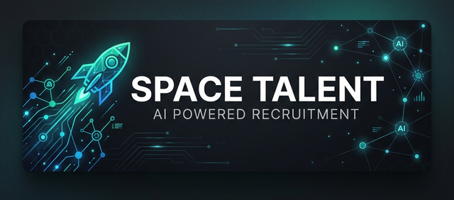

<p align="center">
  
</p>

<h1 align="center">🚀 Space Talent AI</h1>

<p align="center">
  <strong>The Future of Human Potential with Artificial Intelligence.</strong><br>
  An enterprise-grade platform for modern Recruitment & Selection.
</p>

<p align="center">
  
  
  
  
  
</p>

---

## 📖 Vision

**Space Talent AI** is a premium ecosystem designed to revolutionize the recruitment lifecycle. By integrating advanced Artificial Intelligence with a high-performance cloud architecture, we empower HR teams to discover, analyze, and hire top-tier talent with unprecedented speed and precision.

Our mission is to eliminate administrative overhead and provide deep behavioral and technical insights, allowing recruiters to focus on what truly matters: **human connection**.

---

## ✨ Key Features

### 🤖 Intelligent Sourcing & AI Scoring
- **Automated Ranking**: Advanced algorithms that score candidates based on resume-job compatibility.
- **Smart Filtering**: Multi-dimensional search across skills, seniority, and location.

### 📋 Full-Cycle Pipeline Management
- **Visual Kanban**: A dynamic, drag-and-drop workflow to manage candidates across stages.
- **Custom Application Flow**: Tailored question sets and logic-based application forms.

### 📊 Real-time Analytics
- **Strategic KPIs**: Dashboards for Time-to-Hire, Diversity & Inclusion, and Source Effectiveness.
- **Predictive Insights**: Data-driven suggestions for process optimization.

### 🔒 Privacy & Security (PII Protection)
- **Secure Document Storage**: Candidate resumes are protected via private Supabase buckets and Signed URLs.
- **Granular RLS**: Row Level Security (RLS) ensures data is only accessible to authorized recruiters.

### 🌐 Public Integration API
- **External Exposure**: Secure Edge Functions to list and fetch job details for third-party portals.
- **Hybrid Visibility**: Support for "Invisible" jobs—accessible via direct link only for discrete recruitment.

---

## 🛠️ Technology Stack

### Frontend Ecosystem
- **React 18**: Component-based UI architecture.
- **TypeScript**: Full-stack type safety.
- **Vite**: Ultra-fast build tool and development server.
- **Tailwind CSS**: Utility-first styling for a premium, responsive interface.
- **Lucide**: Clean and modern iconography.

### Backend Infrastructure (BaaS)
- **Supabase / PostgreSQL**: Scalable relational database with advanced RLS.
- **Edge Functions**: Deno-based serverless functions for secure API interactions.
- **PostgREST**: Instant and secure RESTful API layer.
- **Supabase Storage**: Secure management of candidate documents.

---

## 🚀 Getting Started

### 1. Prerequisites
- Node.js (v18 or higher)
- A Supabase account and project

### 2. Installation
```bash
# Clone the repository
git clone https://github.com/usabit/rh-ia-v2.git

# Install dependencies
cd rh-ia-v2
npm install
```

### 3. Environment Configuration
Create a `.env` file in the root directory:
```env
VITE_SUPABASE_URL=your_project_url.supabase.co
VITE_SUPABASE_ANON_KEY=your_anon_key
```

### 4. Development Server
```bash
npm run dev
```

---

## 📁 Project Architecture

```text
├── .agent/              # AI Agent configuration and workflows
├── docs/                # Technical documentation and security policies
├── src/
│   ├── core/           # Business logic, services (Supabase, API)
│   ├── layouts/        # Global layout components and Design System
│   ├── pages/          # Feature-based page views
│   └── common/         # Reusable UI components
├── supabase/
│   ├── functions/      # Secure serverless Edge Functions
│   └── migrations/     # Version-controlled database schema
└── README.md           # This document
```

---

## 🔐 Security Standards

This project adheres to strict security protocols to ensure candidate data protection (LGPD/GDPR compliance ready):
- All PII is protected by **PostgreSQL Row Level Security**.
- External APIs are whitelisted and served via **Supabase Edge Functions**.
- Storage access is strictly controlled via **Signed URLs**.

---

<p align="center">
  <strong>Developed with Precision & Passion by Usabit Engineering</strong><br>
  © 2026 Usabit. All rights reserved.
</p>